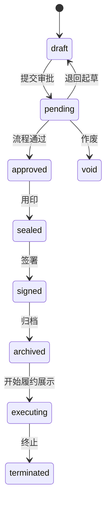

# 合同状态与枚举字典

> 版本：**1.0.0** | 日期：2026-05-18  
> 冻结决策：[DESIGN_STATUS.md](./DESIGN_STATUS.md) D1  
> API 对齐：[api-spec.md](./api-spec.md) v1.1

---

## 1. 合同主状态 `contracts.status`

> V1 **不包含** `reviewing`；评审进行中仍用 `pending`。

| 值 | 中文 | 可编辑 | 说明 |
|----|------|--------|------|
| `draft` | 草稿 | 是 | 未提交 |
| `pending` | 流程中 | 否 | 审批/评审进行中 |
| `approved` | 已通过 | 否 | 流程通过，待用印 |
| `sealed` | 已用印 | 否 | 用印完成 |
| `signed` | 已签署 | 否 | 线下盖章或电子签完成 |
| `archived` | 已归档 | 否 | 只读 |
| `executing` | 执行中 | 否 | V1 仅看板展示 |
| `terminated` | 已终止 | 否 | 提前终止 |
| `void` | 已作废 | 否 | 作废 |

### 1.1 主状态机（Mermaid）

---

## 2. 审批子状态 `contracts.approval_status`

流程进行中（`status=pending`）时必填。

| 值 | 中文 | 典型顺序 |
|----|------|----------|
| `ai_screening` | AI 初筛中 | 1 |
| `dept_approval` | 部门主管审批 | 2（简易流程） |
| `legal_review` | 法务评审 | 3 |
| `finance_review` | 财务评审 | 4（按金额） |
| `executive_approval` | 高管审批 | 5（按金额） |
| `board_approval` | 董事会审批 | 6（特殊流程） |
| `seal_pending` | 待用印 | 7 |
| `done` | 流程结束 | 8 |

---

## 3. AI 审查状态 `ai_reviews`

| 值 | 说明 |
|----|------|
| `reviewing` | 审查进行中 |
| `ai_done` | AI 完成，待法务复核 |
| `reviewed` | 法务已复核 |
| `confirmed` | 结论已确认 |

---

## 4. 评审记录阶段

与 `review-workspace` Tab 对应：`legal` | `finance` | `executive`

---

## 5. 原型展示映射

| 原型文案 | 映射 `status` |
|----------|---------------|
| 待审批 | `pending` |
| 已通过 | `approved` |
| 已签署 | `signed` |
| 已归档 | `archived` |
| 执行中 | `executing` |
