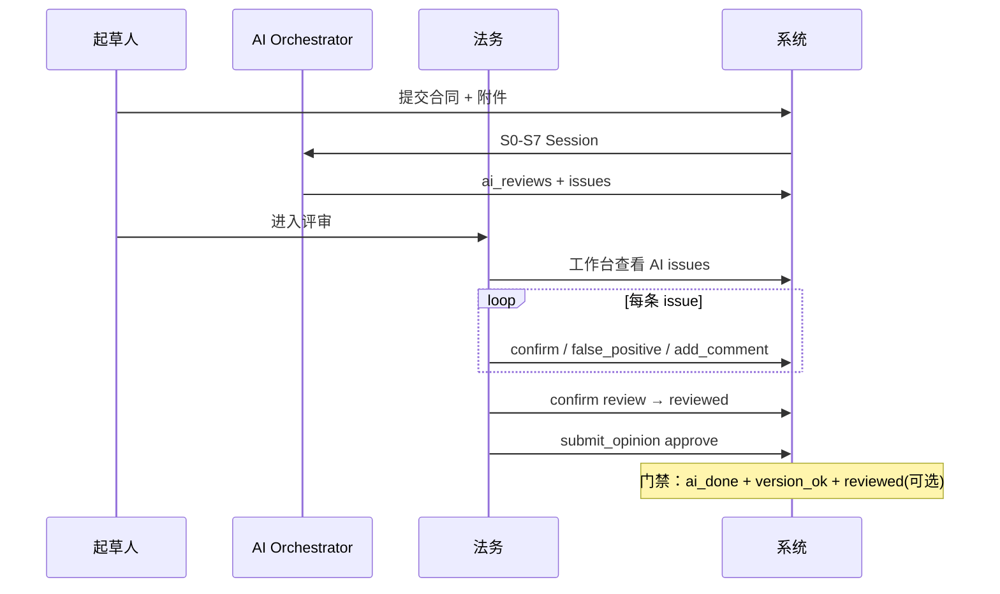

# 大模型深度应用于合同审核 — 总体方案

> **版本**：1.0.0 | **日期**：2026-05-25  
> **定位**：本项目核心竞争力方案；AI 不是附属功能，而是评审链路的 **智能初筛引擎 + 法务协同中枢**。  
> **关联文档**：[ai-review-design.md](../design/ai-review-design.md) · [contract-review-pro-seeds.md](../reference/contract-review-pro-seeds.md) · [workflow-vs-review.md](../design/workflow-vs-review.md) · [ai-review-review-integration-plan.md](./ai-review-review-integration-plan.md) · [mlx-local-dev.md](../../backend/docs/mlx-local-dev.md)

---

## 一、战略定位

### 1.1 要解决的核心问题

| 痛点 | 传统做法 | 大模型应解决的问题 |
|------|----------|-------------------|
| 法务逐条通读耗时长 | 人工全文阅读 | **通读摘要 + 条款级风险定位** |
| 风险遗漏与标准不一 | 依赖个人经验 | **清单驱动 + 种子模板 + 可配置阈值** |
| 法律依据难以及时引用 | 查法规、查案例 | **RAG 法规片段 + 禁止无依据定论** |
| 财务/履约条款隐蔽风险 | 法务侧重法律 | **五维分工 + 规则引擎数值校验** |
| 修订建议难落地 | 口头/邮件反馈 | **revision_method 驱动 revision-workspace** |
| 评审与 AI 报告割裂 | AI 单独一页 | **工作台对照、逐条确认、误报闭环** |

### 1.2 设计原则（不可妥协）

1. **大模型负责语义理解，规则引擎负责可验证结论** — 预付款比例、金额阈值等必须规则可复核。  
2. **无 `legal_basis` 不得输出高风险定论** — 写入 Orchestrator Guardrail（见 ai-review-design §2.3.2）。  
3. **AI 不替代审批决策** — 门禁是「完成初筛」，不是「自动通过」。  
4. **版本绑定** — 合同修订后 AI 审查失效，必须重跑（已实现 P0）。  
5. **可解释、可反馈、可度量** — 每条 issue 可标记误报/漏报，进入迭代数据集。

### 1.3 与评审方案的关系

```text
审批流（业务同意）          评审流（专业审查）
     │                            │
     └──────────┬─────────────────┘
                │
         ┌──────▼──────┐
         │  AI 初筛层   │  ← 本方案主战场
         │  (LLM+规则)  │
         └──────┬──────┘
                │
    ai-review → review-workspace → revision-workspace → 再 AI
```

---

## 二、现状诊断（As-Is，2026-05-25）

### 2.1 已落地能力

| 模块 | 文件 | 成熟度 |
|------|------|--------|
| 五维并行 LLM 审查 | `ai_engine.py` | ★★★ 可 MLX 实机 |
| 条款启发式切分 | `clause_parser.py` | ★★☆ 无 LLM NER |
| 风险加权评分 | `risk_scorer.py` | ★★★ |
| 审查编排 / Mock / 同步 MLX | `ai_review_service.py`, `runner.py` | ★★★ |
| contract-review-pro 种子 JSON | `seeds/ai_review/generated/` | ★★★ 已导入 |
| 评审 AI 门禁 + 版本校验 | `review_service._ensure_ai_gate` | ★★★ P0 |
| 工作台 AI 摘要 | `ReviewWorkspaceView` | ★★☆ P0 |
| PDF/Word 文本提取 | `text_extractor.py` | ★★☆ 未串联审查 |
| 误报/漏报 API | `submit_feedback` | ★★☆ 未进训练闭环 |
| Celery 异步 | `ai_review_tasks.py` | ★★☆ 可用 |

### 2.2 关键缺口（深度应用障碍）

| 缺口 | 影响 | 优先级 |
|------|------|--------|
| **无 Review Session 状态机（S0–S7）** | 跳过通读/门禁，直接五维并行，易幻觉 | P0 架构 |
| **种子 checklist 仅 Prompt 塞 10 条** | 53 项清单未系统执行 | P0 |
| **无 RAG 法规库** | `legal_basis` 多为空或编造风险 | P0 |
| **Issue Schema 不统一** | Mock 有 label_id/gate_id，MLX 无 | P1 |
| **规则引擎未成模块** | 仅 runner 内启发式 | P1 |
| **上传→审查未闭环** | 解析 mock 字段，不触发 LLM | P1 |
| **法务无法逐条确认 AI** | reviewed/confirmed 无业务动作 | P1 |
| **无模板偏离检测** | clause_standards 种子未消费 | P2 |
| **无反馈数据集导出** | 误报/漏报不进 Prompt 优化 | P2 |

### 2.3 当前 LLM 调用模式（需升级）

**现状**：单次合同 → 5 次独立 JSON Prompt → 关键词映射回条款 → 聚合分。

**问题**：

- 无 **通读（S2）** 上下文，维度审查缺乏全局理解  
- 无 **反思（Self-Correction）**，误报率高  
- 无 **按 checklist 逐项** 结构化输出  
- 8000 字截断 + 10 条款上限，长合同覆盖不足  

---

## 三、目标架构（To-Be）

### 3.1 逻辑分层

```text
┌─────────────────────────────────────────────────────────────────┐
│ 表现层：ai-review / review-workspace / revision-workspace        │
├─────────────────────────────────────────────────────────────────┤
│ 编排层：AiReviewOrchestrator（Session S0–S7 + Phase 0–3）          │
│   ├─ PolicyLoader（contract_type → ai_profile_key → YAML）      │
│   ├─ SkillRegistry（parser / gate / dimension / report）        │
│   └─ Guardrails（跳过检测、无依据拦截、版本校验）                  │
├─────────────────────────────────────────────────────────────────┤
│ 能力层                                                           │
│   ├─ LLM Gateway（MLX Qwen3.6，OpenAI 兼容，可切换云端）         │
│   ├─ RuleEngine（auto_detectable checklist + thresholds.json）   │
│   ├─ RAG Service（法规片段 + risk_templates few-shot）           │
│   └─ ClauseParser / TextExtractor / TemplateDiff                 │
├─────────────────────────────────────────────────────────────────┤
│ 数据层：ai_reviews · ai_review_issues（新）· seeds · 反馈集       │
└─────────────────────────────────────────────────────────────────┘
```

### 3.2 大模型能力矩阵（什么用什么）

| 任务 | 首选 | 备选 | 不用 LLM 的原因 |
|------|------|------|----------------|
| PDF/DOCX 转文本 | PyMuPDF/python-docx | — | 确定性 |
| 条款边界识别 | 正则 + LLM 校正 | 纯 LLM | 成本与稳定性 |
| 主体/金额/日期 NER | 规则 + LLM 补全 | — | 数值必须可解析 |
| 通读摘要（S2） | **LLM 1 次** | — | 需语义理解 |
| 效力/主体门禁（S3） | **规则 + LLM** | — | auto_detectable 项规则优先 |
| 五维条款审查（S6） | **LLM 按维度/按条款** | — | 核心能力 |
| 预付款/金额阈值 | **RuleEngine** | — | 必须可审计 |
| 法规依据引用 | **RAG 检索 + LLM 归纳** | — | 防编造 |
| 矛盾/偏离模板 | 向量相似度 + **LLM** | — | 需语义 |
| 报告摘要 | **LLM 1 次** | 模板 | 可读性 |
| 误报复核 | 人工 | LLM 辅助分类 | 责任在人 |

---

## 四、审查 Session 状态机（核心落地方案）

采纳 [ai-review-design.md §2.3.2](../design/ai-review-design.md) 七步 Session，映射到代码模块：

| 步骤 | 名称 | LLM 用法 | 输出物 | 模块（拟） |
|------|------|----------|--------|------------|
| **S0** | client_context | 可选：相对方策略摘要 | `client_policy` | `context_loader.py` |
| **S1** | review_state | 无 | metadata | orchestrator |
| **S2** | read_through | **1× LLM 通读** | 主体/标的/价款/交付/违约/争议 六段摘要 | `skill_read_through.py` |
| **S3** | validity_gates | 规则 + 条件 LLM | 五门禁 `gate_*` | `skill_gates.py` + RuleEngine |
| **S4** | issue_backlog | LLM 列「待研究问题」 | 问题清单 | `skill_backlog.py` |
| **S5** | knowledge_research | **RAG + LLM** | 每条 issue 的 `legal_basis` | `rag_service.py` |
| **S6** | clause_review | **按条款或按维度 LLM** | 结构化 `AiReviewIssue[]` | 升级 `ai_engine.py` |
| **S7** | clause_extract | 可选 LLM | 可入库条款候选 | V2 |
| **—** | aggregate_report | LLM 摘要 + 规则聚合 | `AIReview` 记录 | `runner.py` |

### 4.1 Guardrails（编排器硬约束）

```python
# 伪代码 — 写入 AiReviewOrchestrator
GUARDRAILS = [
    "must_complete_step('S2') before S6",
    "must_complete_step('S3') before S6",
    "high_risk_requires_legal_basis(issue)",
    "no_fabricated_statute(issue.legal_basis)",
    "gate_fail_cannot_downgrade_without_human",
    "ai_version_must_match_contract_version",
]
```

### 4.2 Phase 0–3 与 Session 关系

```text
Phase 0  门禁层     ← S3 输出 gate_validity … gate_output
Phase 1  五维 Skill ← S6（与现有 DIMENSION_PROMPTS 对齐）
Phase 2  聚合       ← 按 label_id 分组、risk_level 排序
Phase 3  修订路由   ← revision_routing.json → revision_method
```

---

## 五、统一 Issue 数据模型

### 5.1 表结构演进

**V1（当前）**：issue 存在 `ai_reviews.clause_reviews` JSON 文本中。

**V1.5（推荐）**：新增 `ai_review_issues` 表，便于工作台逐条操作与统计。

```sql
-- 草案，实施时写入 alembic
CREATE TABLE ai_review_issues (
  id BIGINT PRIMARY KEY AUTO_INCREMENT,
  review_id VARCHAR(50) NOT NULL,          -- FK ai_reviews.review_id
  contract_id INT NOT NULL,
  version_id INT NOT NULL,
  clause_ref VARCHAR(200),
  clause_id VARCHAR(50),
  dimension VARCHAR(50),                   -- finance_check / risk_assessment …
  label_id VARCHAR(10),                    -- L01–L15
  gate_id VARCHAR(50),
  cuad_code VARCHAR(20),
  risk_level VARCHAR(20),
  confidence DECIMAL(4,3),
  title VARCHAR(500),
  description TEXT,
  legal_basis TEXT,
  suggestion TEXT,
  revision_method VARCHAR(30),             -- comment / track_changes / …
  exposure_summary VARCHAR(500),
  human_status VARCHAR(20) DEFAULT 'pending', -- pending / confirmed / false_positive / missed
  human_comment TEXT,
  source VARCHAR(20) DEFAULT 'llm',        -- llm / rule / rag
  created_at DATETIME DEFAULT CURRENT_TIMESTAMP,
  INDEX idx_review (review_id),
  INDEX idx_contract (contract_id)
);
```

### 5.2 JSON Schema（与 Mock / 种子对齐）

单条 issue 必须字段：

```json
{
  "dimension": "finance_check",
  "label_id": "L06",
  "gate_id": "gate_clause",
  "risk_level": "medium",
  "confidence": 0.72,
  "clause_ref": "第三条 付款条件",
  "description": "预付款 40% 超内部上限",
  "legal_basis": "集团采购制度第 3.2 条",
  "suggestion": "建议调整为 30%",
  "revision_method": "comment",
  "source": "rule"
}
```

**规则**：`source=rule` 时 confidence ≥ 0.9；`source=llm` 且 `risk_level=high` 时必须有非空 `legal_basis`（RAG 命中或人工待补）。

---

## 六、Prompt 与 LLM 调用策略（MLX Qwen3.6）

### 6.1 调用预算（单份标准合同 ~20 页）

| 阶段 | 调用次数 | max_tokens | 说明 |
|------|----------|------------|------|
| S2 通读 | 1 | 2048 | 输入：全文 ≤12k 字（分段摘要再合并） |
| S3 门禁（LLM 部分） | 0–1 | 1024 | auto_detectable=false 项 |
| S5 RAG 归纳 | 0–N | 512×命中数 | N ≤ 10 |
| S6 条款审查 | 5 或 ⌈条款数/5⌉ | 2048 | 按维度或按批条款 |
| 报告摘要 | 1 | 1024 | 汇总 |
| **合计** | **约 8–12 次** | — | 本机 MLX 27366，可接受 2–8 分钟 |

### 6.2 长合同策略

1. **Map-Reduce**：按章节 Map 审查 → Reduce 合并 issue（去重 keyword）  
2. **相关条款预筛**：用 checklist 的 `gate_id` + section_type 过滤，避免全量塞 Prompt  
3. **滑动窗口**：单条款上下文带前后各 1 条条款  

### 6.3 Self-Correction（反思）Prompt 模板

```text
你是合同审查质检员。以下 JSON 为初审查结果。
请检查：1) 是否无依据的高风险 2) 是否与通读摘要矛盾 3) 是否重复。
输出 { "accepted": [...], "rejected": [...], "revised": [...] }
```

在 S6 之后、聚合之前 **增加 1 次 LLM 调用**，预计降低误报 15–25%（需 A/B 用误报反馈验证）。

### 6.4 RAG 首期范围（不引入 Chroma 亦可）

| 知识源 | 格式 | 检索方式 |
|--------|------|----------|
| `risk_templates.purchase.json` | JSON | 按 label_id + 关键词 |
| 内置法规片段包 | Markdown/JSON | BM25 或 embedding（V2 上 Chroma） |
| 集团制度 `thresholds.json` | JSON | 直接加载 |

首期 RAG：**模板 + 阈值精确匹配**；二期：**法规向量库**。

---

## 七、规则引擎（与 LLM 分工）

新建 `backend/app/services/ai_review/rule_engine.py`：

| 规则 ID | 来源 | 检测方式 | LLM 角色 |
|---------|------|----------|----------|
| PR-001 | thresholds + checklist | 预付款正则 | 无 |
| PR-002 | counterparty 黑名单 | DB 查询 | 无 |
| VL-001 | checklist auto_detectable | 关键词 + 结构 | 解释说明 |
| FM-001 | 金额与 flow_type | 数值比较 | 无 |

**执行顺序**：RuleEngine.run() → 得到 `rule_issues[]` → LLM S6 不得 contradict 规则结论。

---

## 八、与评审流的深度集成

### 8.1 页面级能力绑定

| 页面 | 深度集成目标 | 阶段 |
|------|--------------|------|
| **create** | 上传 → 解析 → **自动 AI**（失败阻断或强提示） | AI-1 |
| **ai-review** | 门禁摘要 + 15 标签筛选 + 逐条 issue + 误报/漏报 | AI-1 |
| **review-workspace** | AI 摘要 + **逐条确认/驳回** + 跳转条款 | AI-2 |
| **revision-workspace** | 按 `revision_method` 展示批注/修订建议 | AI-2 |
| **review-center** | 按 AI 风险等级排序待办 | AI-3 |
| **clause-compare** | 模板偏离 → 触发 targeted S6 | AI-3 |
| **config** | ai_profile 策略包、阈值、checklist 子集 | AI-2 |

### 8.2 状态机扩展

| ai_reviews.review_status | 触发 | 评审流影响 |
|--------------------------|------|------------|
| `pending/reviewing` | 审查中 | approval_status=ai_screening |
| `ai_done` | 引擎完成 | 可进法务（门禁通过） |
| `reviewed` | 法务确认 AI 报告 | 可选：高管可见「已复核 AI」 |
| `confirmed` | 法务负责人确认 | 归档锁定 AI 结论 |
| `failed` | MLX/超时 | 仅允许 Mock 或重试 |

新增 API：

- `POST /api/v1/ai-review/{review_id}/confirm` — 法务确认  
- `PATCH /api/v1/ai-review/issues/{id}` — 逐条 human_status  

### 8.3 人机协同流程



---

## 九、MLX 本地推理部署（本项目默认）

| 项 | 配置 |
|----|------|
| 推理 | `mlx_lm.server` @ `127.0.0.1:27366` |
| 模型 | `mlx-community/Qwen3.6-35B-A3B-4bit` |
| 后端 | `AI_REVIEW_MOCK=0`, `AI_REVIEW_SYNC=1`（开发） |
| API | FastAPI `:8000`，前端 Vite `:8080` |

**生产演进**：

- 开发：SYNC 同步（简单）  
- 生产：Celery + 队列 `ai_review`，并发限制 2（Apple Silicon 内存）  
- 备选：云端 API 作 fallback（`AI_BASE_URL` 可配置）

---

## 十、质量保障与反馈闭环

### 10.1 指标（KPI）

| 指标 | 定义 | 目标（V2） |
|------|------|------------|
| 法务评审耗时 | 进工作台 → 首次提交意见 | ↓ 30% |
| AI 条款召回 | 法务标记「漏报」占比 | < 10% |
| AI 误报率 | false_positive / 总 issue | < 20% |
| 有依据高风险占比 | 含 legal_basis 的 high/critical | > 90% |
| 审查完成率 | ai_done / 触发数 | > 95% |
| P95 审查时延 | 同步/异步 | < 10 min |

### 10.2 反馈数据集

`submit_feedback` + issue 级 `human_status` → 定期导出 `seeds/ai_review/feedback/export-{date}.jsonl`，用于：

- Prompt few-shot 增补  
- 规则阈值调参  
- 误报分析报告  

---

## 十一、分期路线图

### Phase AI-0：基线稳固（1 周，部分已完成）

- [x] MLX 同步审查链路  
- [x] 评审门禁 + 版本校验  
- [x] 工作台 AI 摘要  
- [x] gates/rules 启发式（runner）  
- [ ] 单元测试覆盖 orchestrator 接口草案  

### Phase AI-1：Session + 规则 + Schema（2–3 周）

| 交付 | 说明 |
|------|------|
| `AiReviewOrchestrator` | 实现 S2→S3→S6→aggregate，替换 runner 直调 ai_engine |
| `rule_engine.py` | 消费 checklist `auto_detectable` + thresholds |
| 统一 Issue Schema | runner/mock/engine 输出一致；写入 clause_reviews |
| `ai-review` UI | 15 标签筛选、legal_basis 列、source 徽章 |
| 上传→审查 | 合同 upload 完成后可选自动 `start_review` |

**验收**：MLX 路径 issue 含 label_id、gate_id；预付款规则与 Mock 一致；无法务误读 DEMO gates。

### Phase AI-2：RAG + 人机协同（3–4 周）

| 交付 | 说明 |
|------|------|
| `rag_service.py` | risk_templates + 法规片段 BM25 |
| S5 knowledge_research | 高风险 issue 必须有 basis 或 `needs_research` |
| Self-Correction | S6 后 1 次质检 LLM |
| `ai_review_issues` 表 | 逐条 API + 工作台确认 UI |
| `POST .../confirm` | reviewed 状态 |
| revision_method | revision-workspace 分 comment/track_changes |

**验收**：high 级 issue 90%+ 有 legal_basis；法务可在工作台确认/误报。

### Phase AI-3：模板偏离 + 智能调度（4–6 周）

| 交付 | 说明 |
|------|------|
| clause_standards 消费 | clause-compare 偏离 → 追加 S6 |
| Policy YAML | purchase/sales 等 ai_profile 包 |
| Map-Reduce 长合同 | >20 页自动分段 |
| RiskAlert 自动 | high/critical → 消息中心 |
| Celery 生产化 | SYNC=0，监控与重试 |

### Phase AI-4：持续优化（持续）

- Chroma 法规向量库  
- 误报数据集 → Prompt 自动迭代  
- 多模型路由（小模型筛 + 大模型深审）  
- 导出法务意见 DOCX（contract-review-pro 终稿三件套）

---

## 十二、代码目录规划（目标态）

```text
backend/app/services/ai_review/
├── orchestrator.py          # Session S0-S7 状态机
├── context_loader.py        # S0 相对方/策略
├── skills/
│   ├── read_through.py      # S2
│   ├── gates.py             # S3
│   ├── clause_review.py     # S6（自 ai_engine 演进）
│   └── report.py            # 聚合
├── rule_engine.py           # 规则（从 runner 抽出）
├── rag_service.py           # S5
├── runner.py                # 薄封装，调 orchestrator
├── ai_engine.py             # LLM Gateway 封装
├── clause_parser.py
├── text_extractor.py
├── risk_scorer.py
└── seed_store.py

backend/policies/            # 新增
├── purchase.yaml
├── sales.yaml
└── default.yaml
```

---

## 十三、风险与对策

| 风险 | 对策 |
|------|------|
| LLM 幻觉法条 | RAG + Guardrail + 无 basis 不得 high |
| 长合同超时 | Map-Reduce + Celery + 异步 UI 轮询 |
| MLX 内存不足 | 减小并发、换小模型做 S2、云端 fallback |
| 法务不信任 AI | 工作台逐条确认、误报按钮、规则可解释 |
| Mock/真实不一致 | 统一 Schema 单测 + CI 双路径测试 |
| 种子与 Prompt 漂移 | manifest 版本号 + 变更日志 |

---

## 十四、与现有 PR 计划关系

| 文档 | 关系 |
|------|------|
| [ai-review-review-integration-plan.md](./ai-review-review-integration-plan.md) | P0 集成项 ≈ 本方案 Phase AI-0 |
| PR-5～PR-8 | 并入 Phase AI-1 / AI-2 |
| [ai-review-design.md](../design/ai-review-design.md) | 技术蓝图；本方案为 **可执行落地方案** |

---

## 十五、近期行动项（建议 Sprint 排序）

1. **立项 Phase AI-1**：创建 `orchestrator.py` 骨架，S2 通读 + S3 规则门禁先行。  
2. **抽取 `rule_engine.py`**：迁移 runner 启发式 + 接入 checklist JSON。  
3. **Issue Schema 单测**：Mock / MLX / 规则三路输出同一 JSON Schema。  
4. **ai-review 页**：展示 `legal_basis`、`source`、`label_id`。  
5. **设计评审**：法务确认 S2/S3 硬约束与 KPI 目标。

---

## 附录 A：参考调用链（Phase AI-1 目标）

```text
POST /api/v1/ai-review/review
  → ai_review_service.start_review
    → AiReviewOrchestrator.run(contract_id, version_id)
        → S0 load_context(counterparty, policy YAML)
        → S2 skill_read_through(LLM)
        → S3 skill_gates(RuleEngine + LLM)
        → S6 skill_clause_review(LLM × N)
        → rule_engine.merge()
        → S5 rag_service.enrich_issues(high_risk_only)
        → self_correction(LLM)
        → aggregate → ai_reviews + issues[]
    → notify / audit_log
```

---

**维护**：Phase 完成时更新本文版本号与 checkbox；重大架构变更同步 [DESIGN_STATUS.md](../design/DESIGN_STATUS.md) D6 与 AI 范围说明。
