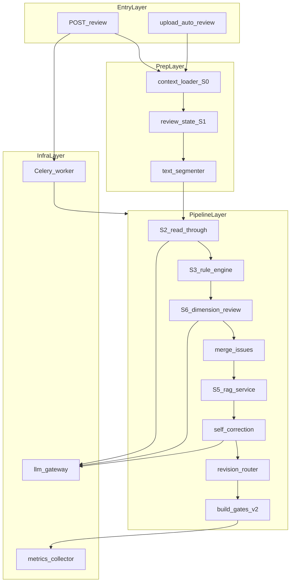

# AI 合同审查能力补强 — 详细设计文档

> **版本**：1.0.0  
> **日期**：2026-05-25  
> **状态**：待评审  
> **作者**：平台开发（基于 2026-05 代码审计）  
> **关联文档**：[ai-review-design.md](../design/ai-review-design.md) · [ai-llm-contract-review-deep-scheme.md](./ai-llm-contract-review-deep-scheme.md) · [ai-review-flow.md](../reference/ai-review-flow.md)

---

## 修订记录

| 版本 | 日期 | 说明 |
|------|------|------|
| 1.0.0 | 2026-05-25 | 初稿：问题清单、To-Be 架构、模块详细设计、分期与验收 |

---

## 1. 背景与范围

### 1.1 背景

AI 审查模块已完成 **AI-0～AI-2 骨架**（Orchestrator、五维 LLM、规则引擎 MVP、Issue 表、人机确认、评审门禁）。代码审计表明：

- **大模型能力落地深度约 35～40%**：种子数据（53 项 checklist、15 risk_labels） largely 未驱动 Prompt；
- **生产就绪不足**：默认 Mock、无 LLM timeout、Celery 未验收、失败态不可见。

本设计在 **不改变产品定位**（「AI 初筛 + 法务必审」）前提下，补齐模型能力深度与 Pilot 部署基线。

### 1.2 范围

| 在范围内 | 不在范围内（Phase AI-4+） |
|----------|---------------------------|
| Prompt/Schema 深化、规则扩展、RAG BM25 | Chroma 向量库全量建设 |
| LLM Gateway、完整性、Celery 硬化 | 多模型路由、云端 fallback 实装 |
| Map-Reduce 长合同、KPI 度量 | Policy YAML 热更新平台 |
| 前端 completeness/reasoning 展示 | DOCX 终稿三件套 |
| S0 轻量 context（相对方/金额） | S7 条款入库、clause_standards 偏离 |

### 1.3 术语

| 术语 | 含义 |
|------|------|
| Session | 单次 `start_review` 触发的审查过程 |
| Issue | 统一 Schema `AiReviewIssue` 的一条发现 |
| Gate | 五门禁 `gate_validity` 等 |
| Seed | `backend/seeds/ai_review/generated/*.json` |
| completeness | 审查完整度：`full` / `partial` / `failed` |

---

## 2. 现状与问题（As-Is）

### 2.1 问题总表

#### 大模型能力（M）

| ID | 问题 | 根因文件 | 严重度 |
|----|------|----------|--------|
| M1 | 53 项清单未驱动模型 | `ai_engine._build_dimension_prompt` 仅取 checklist 前 10 条 | 高 |
| M2 | 15 risk_labels 未进 Prompt | `DimensionRequest.risk_labels` 未写入 Prompt | 高 |
| M3 | 合同类型策略未用 | `contract_type_profiles.json` 未消费 | 中 |
| M4 | revision_routing 未用 | `orchestrator._review_result_to_issues` 硬编码 `comment` | 中 |
| M5 | 无 CoT / 证据链 | Prompt 无 reasoning/evidence_quote | 高 |
| M6 | 长合同截断 | 正文 8000 字、条款 10×500 字 | 高 |
| M7 | RAG 过浅 | `rag_service` 关键词匹配 | 中 |
| M8 | 条款-issue 映射脆弱 | keyword 子串匹配 | 中 |
| M9 | LLM 失败静默 | 维度失败 score=50 | 高 |
| M10 | 默认 Mock | `AI_REVIEW_MOCK=True` | 中 |

#### 规则与门禁（R）

| ID | 问题 | 严重度 |
|----|------|--------|
| R1 | 规则仅 3/53 auto_detectable + 预付款 + 大额 | 高 |
| R2 | 五门禁为启发式，非 checklist 逐项 | 中 |
| R3 | S0/S1/S7 未实现 | 低 |

#### 工程与生产（P）

| ID | 问题 | 严重度 |
|----|------|--------|
| P1 | 无 LLM timeout | 高 |
| P2 | Celery async task 未 CI 验收 | 高 |
| P3 | API 状态 `completed` vs DB `ai_done` 混用 | 中 |
| P4 | 无 review 限流/去重 | 中 |
| P5 | 无可观测指标 | 中 |
| P6 | KPI 未自动化 | 中 |
| P7 | retry_review 无 API | 低 |
| P8 | PDF 中文不可用 | 低 |

### 2.2 当前调用链（As-Is）

```text
POST /ai-review/review
  → ai_review_service.start_review
      → [Mock] build_mock_payload
      → [Sync] run_contract_ai_review
          → orchestrator.run
              → S2 read_through (1× LLM)
              → S3 rule_engine (无 LLM)
              → S6 ai_engine.review (5× LLM 并行)
              → merge → S5 enrich (关键词)
              → self_correction (0~1× LLM)
              → build_gates
      → persist_review_result
```

单次真实审查：**7～8 次 LLM 调用**（Mock 为 0）。

---

## 3. 设计目标与原则

### 3.1 目标

1. **可解释**：每条 issue 含 `reasoning` + `evidence_quote`（可选折叠展示）。
2. **可分类**：MLX 路径 issue **≥80%** 含合法 `label_id`（L01～L15）。
3. **有据可查**：high/critical **≥90%** 有 `legal_basis` 或 `needs_research=true`。
4. **失败可见**：`review_completeness != full` 时 UI 明确警告，禁止误读 score。
5. **Pilot 可部署**：Celery 全链路验收 + timeout + 生产 Mock 门禁。

### 3.2 继承硬约束（ai-review-design §2.3）

1. 禁止跳过 S2 通读  
2. 禁止跳过 S3 效力/主体门禁（规则 + LLM checklist_coverage 等价覆盖）  
3. 禁止无依据的 high/critical 定论（guardrail + RAG）  
4. 禁止编造法条（RAG snippet_id + 无匹配则降级）

### 3.3 新增工程原则

- **Fail-visible**：失败写入 `summary`，不伪装成中等风险。  
- **Seed-driven Prompt**：清单/标签/类型策略结构化注入，禁止「固定前 N 条」。  
- **Mock/Real 同 Schema**：Mock 生成须含 label_id、gate_id、revision_method。

---

## 4. 目标架构（To-Be）

### 4.1 逻辑架构



### 4.2 模块目录（目标态）

```text
backend/app/services/ai_review/
├── orchestrator.py           # 编排入口（改造）
├── prompt_builder.py         # 【新增】Prompt 组装
├── llm_gateway.py            # 【新增】LLM 统一调用
├── context_loader.py         # 【新增】S0 上下文
├── text_segmenter.py         # 【新增】长合同分段
├── revision_router.py        # 【新增】修订方式路由
├── metrics.py                # 【新增】KPI 聚合
├── ai_engine.py              # 改造：委托 prompt_builder + gateway
├── rule_engine.py            # 扩展 Batch-1～3
├── rag_service.py            # 分层：keyword / bm25 / chroma
├── issue_schema.py           # 扩展字段
├── runner.py
├── clause_parser.py
└── skills/
    ├── read_through.py       # 改造：经 gateway
    ├── gates.py              # gates_v2
    └── self_correction.py    # 改造：经 gateway
```

---

## 5. 数据模型设计

### 5.1 AiReviewIssue 扩展字段

在 [issue_schema.py](../../backend/app/services/ai_review/issue_schema.py) 的 `AiReviewIssue` 上新增：

| 字段 | 类型 | 必填 | 说明 |
|------|------|------|------|
| `reasoning` | `str` | 否 | CoT 推理摘要（≤500 字） |
| `evidence_quote` | `str` | 否 | 合同原文摘录（≤300 字） |
| `snippet_id` | `str` | 否 | RAG 命中片段 ID |
| `checklist_item_id` | `int` | 否 | 关联 checklist.id |
| `dimension_status` | `str` | 否 | 维度级：`ok`/`degraded`/`failed` |

现有字段保留：`label_id`, `gate_id`, `legal_basis`, `needs_research`, `revision_method`, `human_status`。

### 5.2 AIReview.summary 扩展结构

```json
{
  "read_through": { "parties": "...", "overall": "..." },
  "dimensions": [ { "dimension": "compliance", "score": 72, "status": "ok" } ],
  "gates": { "gate_validity": { "status": "warn", "summary": "..." } },
  "review_completeness": "full",
  "completeness_detail": {
    "s2_status": "ok",
    "dimension_failures": [],
    "segment_count": 1
  },
  "checklist_summary": {
    "total": 18,
    "pass": 12,
    "fail": 3,
    "unknown": 3
  },
  "model_version": "mlx-community/Qwen3.6-35B-A3B-4bit",
  "prompt_version": "pb-v1.0"
}
```

### 5.3 LLM 维度输出 Schema（DimensionLLMResponse）

```python
class DimensionIssueItem(BaseModel):
    keyword: str
    severity: Literal["low", "medium", "high", "critical"]
    description: str
    label_id: Optional[str] = None      # 必须来自 L01-L15 枚举
    gate_id: Optional[str] = None
    reasoning: Optional[str] = None
    evidence_quote: Optional[str] = None
    legal_basis_candidate: Optional[str] = None

class ChecklistCoverageItem(BaseModel):
    item_id: int
    status: Literal["pass", "fail", "unknown"]
    note: Optional[str] = None

class DimensionLLMResponse(BaseModel):
    dimension: str
    score: float = Field(ge=0, le=100)
    issues: list[DimensionIssueItem] = []
    summary: str = ""
    checklist_coverage: list[ChecklistCoverageItem] = []
```

### 5.4 审查完整度判定

```python
def compute_completeness(
    s2_status: str,           # ok | heuristic | failed
    dimension_statuses: list[str],  # 每维 ok | degraded | failed
    pipeline_exception: bool,
) -> tuple[str, dict]:
    """
    返回 (review_completeness, completeness_detail)
    """
```

| 条件 | `review_completeness` |
|------|------------------------|
| `pipeline_exception` 或 Celery 最终 failed | `failed` |
| 任一维 `failed` 或 S2=`heuristic`/`failed` | `partial` |
| 全部维 `ok` 且 S2=`ok` | `full` |

** - `degraded`（LLM 超时但返回占位）计为 `partial` 的子状态，写入 `dimension_failures`。

---

## 6. 模块详细设计

### 6.1 prompt_builder.py

#### 6.1.1 职责

- 按维度、门禁、合同类型组装 Prompt；
- 注入过滤后的 checklist、risk_labels、type profile；
- 输出 system + user 消息与 `prompt_version` 标识（便于 A/B 与审计）。

#### 6.1.2 维度与门禁映射

| LLM dimension | 映射 gate_id | 典型 checklist category |
|---------------|--------------|-------------------------|
| `compliance` | `gate_validity`, `gate_subject` | 宏观-交易类型、主体 |
| `risk` | `gate_clause` | 违约、争议 |
| `financial` | `gate_clause` | 价款与支付 |
| `capability` | `gate_clause` | 交付验收 |
| `anomaly` | `gate_consistency` | 形式、一致性 |

#### 6.1.3 Checklist 过滤算法

```python
def filter_checklist_for_dimension(
    items: list[dict],
    dimension: str,
    contract_type: str,
    profile: dict,
    max_items: int = 15,
) -> list[dict]:
    """
    1. 按 DIMENSION_GATE_MAP[dimension] 过滤 gate_id
    2. 若 profile.review_points 含 item_id 白名单，取交集
    3. 按 gate_priority 升序、risk_level 降序排序
    4. 截断至 max_items
    """
```

#### 6.1.4 Risk labels 注入格式

```text
【风险标签枚举】输出 issue 时必须选用下列 label_id之一：
- L01 合同效力 (gate_validity)
- L06 价款与支付 (gate_clause)
...
若无法匹配，label_id 留空，不得编造。
```

#### 6.1.5 Prompt 模板结构

```text
[System] 资深合同审查专家 + JSON Schema 说明 + 四条硬约束

[User]
## 合同类型
{type} — {profile.review_focus}

## 审查维度
{dimension_prompt}

## 合同正文（片段）
{segment_text[:10000]}

## 相关条款
{clauses_formatted}

## 本维度审查清单（须逐条评估，输出 checklist_coverage）
{checklist_items}

## 风险标签枚举
{risk_labels_table}

## 输出要求
直接输出 JSON，包含 dimension/score/issues/checklist_coverage/summary
issues 每项含 reasoning、evidence_quote（从正文摘录）
```

#### 6.1.6 label_id 后处理校验

```python
VALID_LABEL_IDS = frozenset({"L01", ..., "L15"})

def sanitize_label_id(raw: str | None) -> str | None:
    if raw in VALID_LABEL_IDS:
        return raw
    return None
```

---

### 6.2 llm_gateway.py

#### 6.2.1 接口

```python
class LLMGateway:
    def __init__(self):
        self._client = AsyncOpenAI(
            api_key=settings.AI_API_KEY,
            base_url=settings.AI_BASE_URL,
            timeout=settings.AI_REQUEST_TIMEOUT,  # 默认 120.0
            max_retries=0,  # 应用层控制重试
        )

    async def complete_json(
        self,
        *,
        messages: list[dict],
        caller: str,           # 如 "s2_read_through" / "dim_compliance"
        max_retries: int = 2,
    ) -> tuple[dict, LLMCallMeta]:
        ...

@dataclass
class LLMCallMeta:
    caller: str
    latency_ms: int
    prompt_hash: str
    success: bool
    error_type: str | None
```

#### 6.2.2 重试策略

| 异常类型 | 重试 |
|----------|------|
| `APITimeoutError` | 是，最多 2 次，指数退避 2s/4s |
| `APIStatusError` 5xx | 是 |
| `JSONDecodeError` | 否（记 degraded） |
| 4xx | 否 |

#### 6.2.3 日志

```text
INFO ai_review.llm caller=dim_financial latency_ms=8234 prompt_hash=abc123 success=true
WARN ai_review.llm caller=dim_risk error=timeout retry=1
```

---

### 6.3 context_loader.py（S0 轻量）

#### 输入

- `contract_id`, `db session`

#### 输出 `ReviewContext`

```python
@dataclass
class ReviewContext:
    contract_type: str
    amount: float | None
    counterparty_name: str | None
    counterparty_risk: str | None   # 来自 counterparties 表，可选
    flow_type: str | None
    profile_key: str                # contract_type_map 映射
    type_profile: dict              # contract_type_profiles 子集
```

#### 逻辑

1. 读 Contract + 可选 Counterparty  
2. `get_contract_type_map()` → `profile_key`  
3. `contract_type_profiles.json` 按 profile_key 取 review_points  
4. 若相对方黑名单 → 写入 context flags（规则引擎可读）

---

### 6.4 text_segmenter.py

#### 触发条件

`len(contract_text) > settings.AI_REVIEW_SEGMENT_THRESHOLD`（默认 12000）

#### 分段策略

1. **优先**：按 `clause_parser.parse_clauses` 的条款边界，每段 ≤ `AI_REVIEW_SEGMENT_SIZE`（默认 10000 字）  
2. **回退**：固定窗口滑动，重叠 500 字防断句  

#### Orchestrator 集成

```python
if segmenter.should_segment(text):
    segments = segmenter.split(text, clauses)
    all_issues = []
    for seg in segments:
        partial = await run_s6_for_segment(seg, ctx)
        all_issues.extend(partial)
    issues = merge_issues(*group_by_source(all_issues))
    summary["segment_count"] = len(segments)
else:
    issues = await run_s6_full(text, ctx)
```

Self-Correction **仅在合并后执行 1 次**。

---

### 6.5 rule_engine 扩展（Batch-1）

#### 新增规则（配置驱动，ID 写入 checklist 或 rules.json）

| rule_id | 检测方式 | 默认 risk |
|---------|----------|-----------|
| CK-46 | 币种符号混用（￥/USD/EUR 同段） | medium |
| CK-47 | 「单方」「任意解除」关键词 | high |
| CK-48 | 「放弃诉权」「无限责任」 | critical |
| CK-49 | 签署栏缺失（「签字」「盖章」无对应栏位） | medium |
| CK-50 | 适用法律/管辖缺失 | high |
| TH-BLACKLIST | counterparty 黑名单 | critical |

规则输出须含：`rule_id`, `label_id`, `gate_id`, `source=rule`, `legal_basis`。

#### LLM checklist_coverage 交叉校验

Orchestrator 将 LLM 返回的 `checklist_coverage` 中 `status=fail` 且规则未命中项，转为 **低置信 LLM issue**（`confidence≤0.6`），避免重复。

---

### 6.6 rag_service 升级

#### 6.6.1 模式开关 `AI_RAG_MODE`

| 模式 | 实现 |
|------|------|
| `keyword` | 现有逻辑（默认，兼容） |
| `bm25` | Phase AI-3：索引 legal_snippets + risk_templates |
| `chroma` | Phase AI-4：向量库 |

#### 6.6.2 BM25 接口（Phase AI-3）

```python
class LegalSnippetIndex:
    def build(snippets: list[dict]) -> None
    def search(query: str, top_k: int = 3) -> list[ScoredSnippet]

@dataclass
class ScoredSnippet:
    snippet_id: str
    text: str
    score: float
    source: str
```

`enrich_issues` 逻辑：

1. 对 `risk_level in (medium, high, critical)` 且无 `legal_basis` 的 issue  
2. `query = title + description + evidence_quote`  
3. BM25 top-1 score > threshold → 写入 `legal_basis` + `snippet_id`，`source` 改为 `rag`  
4. 否则 `needs_research=True`；若原 `high/critical` → guardrail 降级  

---

### 6.7 revision_router.py

#### 映射优先级

1. `label_id` → `cuad_label_bridge.json` → `issue_type`  
2. `issue_type` → `revision_routing.json` → `default_method`  
3. 回退：`comment`

#### 示例

| label / 类型 | revision_method |
|--------------|-----------------|
| 形式/错别字类 | `track_changes` |
| 条款实质风险 | `comment` |

```python
def resolve_revision_method(
    issue: AiReviewIssue,
    routing: dict,
    bridge: dict,
) -> str:
    ...
```

---

### 6.8 build_gates_v2

在 [gates.py](../../backend/app/services/ai_review/skills/gates.py) 增加 `build_gates_v2`：

| Gate | v2 逻辑 |
|------|---------|
| `gate_validity` | rule 源 validity fail **或** checklist_coverage 中 gate_validity 项 fail≥1 → fail/warn |
| `gate_subject` | read_through.parties 含「待」或 subject checklist fail |
| `gate_clause` | high/critical issue 数 **或** clause checklist fail 比例 |
| `gate_consistency` | consistency checklist fail |
| `gate_output` | `review_completeness != full` → warn；否则 pending |

---

### 6.9 ai_review_service 改造

#### 6.9.1 状态统一

- 对外 API **仅**返回：`pending` | `reviewing` | `ai_done` | `reviewed` | `failed`  
- 删除 `get_review_status` 中 Celery 映射为 `completed` 的分支  
- `get_review_result` 允许状态：`ai_done`, `reviewed`, `confirmed`

#### 6.9.2 并发控制

```python
async def start_review(...):
    existing = await db.execute(
        select(AIReview).where(
            AIReview.contract_id == contract_id,
            AIReview.version_id == version_id,
            AIReview.review_status == "reviewing",
        )
    )
    if existing.scalar_one_or_none():
        raise HTTPException(409, detail="该版本审查进行中，请稍后")
```

可选：Redis `INCR ai_review:inflight` 与 `AI_REVIEW_MAX_CONCURRENT` 比较。

#### 6.9.3 retry API

```http
POST /api/v1/ai-review/{review_id}/retry
Authorization: Bearer ...
Response: { review_id, status: "reviewing" }
```

仅 `review_status=failed` 可调用；内部复用 `retry_review`（**修复**：创建新 review 记录而非 mutate review_id）。

---

### 6.10 Celery 任务改造

#### 6.10.1 Sync wrapper

```python
@celery_app.task(name="ai_review.contract_review", bind=True, max_retries=3)
def execute_contract_review_sync(self, contract_id, version_id, review_id):
  import asyncio
  return asyncio.run(_execute_contract_review_async(...))
```

#### 6.10.2 队列配置

```bash
celery -A app.celery_app worker -Q ai_review -c 2 -l info
```

#### 6.10.3 验收脚本 `scripts/verify_celery_ai_review.sh`

1. 启动 Redis + worker  
2. `AI_REVIEW_MOCK=0 AI_REVIEW_SYNC=0` POST review  
3. 轮询直至 `ai_done` 或 600s timeout  
4. 断言 `review_completeness` 存在且 issues≥1  

---

### 6.11 metrics.py

#### 6.11.1 聚合 API

```http
GET /api/v1/ai-review/metrics/summary?days=30
Role: admin
```

```json
{
  "period_days": 30,
  "review_total": 120,
  "completion_rate": 0.95,
  "p95_duration_seconds": 480,
  "high_critical_with_basis_rate": 0.91,
  "false_positive_rate": 0.15,
  "label_id_coverage_rate": 0.83,
  "completeness_full_rate": 0.88
}
```

#### 6.11.2 SQL 口径

- `completion_rate` = count(status=ai_done) / count(status in (ai_done, failed))  
- `high_critical_with_basis_rate` = issues where risk in (high,critical) and (legal_basis is not null or needs_research)  
- `false_positive_rate` = count(human_status=false_positive) / count(human_status != pending)

---

## 7. API 变更摘要

| 方法 | 路径 | 变更 |
|------|------|------|
| POST | `/api/v1/ai-review/review` | 409 并发冲突；响应含 `completeness`（完成后） |
| GET | `/api/v1/ai-review/{id}/result` | 含 `completeness`、`checklist_summary` |
| GET | `/api/v1/ai-review/contracts/{id}/latest-review` | 同上 |
| POST | `/api/v1/ai-review/{id}/retry` | **新增** |
| GET | `/api/v1/ai-review/metrics/summary` | **新增**（admin） |
| PATCH | `/api/v1/ai-review/issue/{id}` | 无 breaking change |
| GET | `/api/v1/ai-review/{id}/issues` | 响应 issue 含 reasoning/evidence_quote |

---

## 8. 前端设计

### 8.1 AiReviewView.vue

| 元素 | 行为 |
|------|------|
| 完整度 Banner | `completeness=partial` 黄色；`failed` 红色 |
| Issue 表格 | 新增「推理」「原文依据」折叠列 |
| 标签筛选 | 依赖 `label_id`，空则显示「未分类」 |
| 轮询 | 保持 2s；`reviewing` 显示进度文案 |

### 8.2 ReviewWorkspaceView.vue

- 顶部 AI 摘要区展示 `completeness` + gate 失败数  
- Issue 行展示 `evidence_quote` tooltip  

### 8.3 类型扩展 `ai-review.ts`

```typescript
export interface AiReviewIssue {
  reasoning?: string
  evidence_quote?: string
  snippet_id?: string
  checklist_item_id?: number
}

export interface AiReviewSummary {
  review_completeness?: 'full' | 'partial' | 'failed'
  completeness_detail?: Record<string, unknown>
  checklist_summary?: { total: number; pass: number; fail: number; unknown: number }
}
```

---

## 9. 配置项

| 变量 | 默认 | 说明 |
|------|------|------|
| `AI_REQUEST_TIMEOUT` | `120` | 单次 LLM 超时（秒） |
| `AI_REVIEW_SEGMENT_THRESHOLD` | `12000` | 分段触发字数 |
| `AI_REVIEW_SEGMENT_SIZE` | `10000` | 单段最大字数 |
| `AI_REVIEW_MAX_CONCURRENT` | `2` | 全局 reviewing 上限（可选 Redis） |
| `AI_RAG_MODE` | `keyword` | keyword / bm25 / chroma |
| `AI_RAG_BM25_MIN_SCORE` | `1.5` | BM25 命中阈值 |
| `AI_PROMPT_VERSION` | `pb-v1.0` | 写入 summary |
| `AI_ALLOW_MOCK_IN_PROD` | `false` | 生产是否允许 Mock |
| `ENV` | `development` | production 时检查 Mock |

`.env.mlx.example` 补充上述项。

---

## 10. 测试策略

### 10.1 单元测试

| 模块 | 用例 |
|------|------|
| `prompt_builder` | 各维度 checklist 数量≤15；含 label 表；快照测试 |
| `sanitize_label_id` | 非法 id → None |
| `compute_completeness` | 全 ok → full；一维 failed → partial |
| `revision_router` | L06 → comment；形式类 → track_changes |
| `rule_engine` Batch-1 | 各规则触发/不触发 |
| `llm_gateway` | mock timeout 重试次数 |

### 10.2 集成测试

| 场景 | Mock | MLX |
|------|------|-----|
| review → issues 含 label_id | CI | nightly |
| completeness=partial 模拟 | mock LLM 超时 | — |
| confirm + patch issue | CI | — |
| Celery 全链路 | skip CI | staging |

### 10.3 黄金样本（Phase AI-3 建立）

- 路径：`backend/tests/fixtures/contracts/golden/`  
- 20 份标注合同 + 期望 issue 关键词  
- 度量：recall@issue / label_id_accuracy  

---

## 11. 分期实施与验收

### Phase AI-2.5：模型能力深化（2～3 周）

| 序号 | 任务 | 产出 |
|------|------|------|
| 1 | prompt_builder + Schema | M1,M2,M3,M5 |
| 2 | llm_gateway + completeness | M9,P1 |
| 3 | revision_router | M4 |
| 4 | rule_engine Batch-1 | R1 |
| 5 | gates_v2 | R2 |
| 6 | 前端 Banner + reasoning 列 | — |
| 7 | 单测 + Mock label 对齐 | — |

**验收标准**：

- [ ] MLX 路径随机 20 份样本，issue **≥80%** 含合法 `label_id`  
- [ ] 预付款/大额规则与 Mock 字段结构一致  
- [ ] 断开 MLX 后 `completeness=partial|failed`，UI 有警告  
- [ ] `pytest tests/test_ai_review_runner.py tests/test_orchestrator.py` 全绿  

### Phase AI-3：生产化与长文本（3～4 周）

| 序号 | 任务 | 产出 |
|------|------|------|
| 1 | BM25 RAG | M7 |
| 2 | text_segmenter | M6 |
| 3 | Celery sync wrapper + retry API | P2,P7 |
| 4 | 限流 + 状态统一 | P3,P4 |
| 5 | metrics API | P5,P6 |
| 6 | 生产 Mock 门禁 | M10 |
| 7 | verify_celery 脚本 | — |

**验收标准**：

- [ ] Celery 10 份合同 ai_done，无 worker 崩溃  
- [ ] high/critical **≥90%** legal_basis 或 needs_research（metrics 可查）  
- [ ] P95 duration < 600s（concurrency=2）  
- [ ] production 配置下 `AI_REVIEW_MOCK=1` 启动失败或强告警  

### Phase AI-4（ backlog）

Chroma、Policy YAML、clause_standards、DOCX、多模型路由 — 对齐 [ai-llm-contract-review-deep-scheme.md](./ai-llm-contract-review-deep-scheme.md) § Phase AI-4。

---

## 12. 风险与缓解

| 风险 | 影响 | 缓解 |
|------|------|------|
| Prompt 超 context | 调用失败 | 分段 + checklist≤15 |
| LLM 成本上升 | 预算 | Map-Reduce 仅长合同；Self-Correction 1 次 |
| label_id 幻觉 | 错误统计 | 枚举校验 + 空值 |
| 法务过度依赖 AI | 合规 | completeness 警告 + 必审门禁保留 |
| Mock/Real 行为不一致 | E2E 失真 | Mock 生成对齐 Schema；CI 双轨 |

---

## 13. 文档与代码衔接

| 动作 | 负责 |
|------|------|
| 更新 [ai-llm-contract-review-deep-scheme.md](./ai-llm-contract-review-deep-scheme.md) §十一 插入 AI-2.5 | 开发 |
| 更新 [ai-review-flow.md](../reference/ai-review-flow.md) 差距表 | 开发 |
| [DESIGN_STATUS.md](../design/DESIGN_STATUS.md) 变更日志 v1.2 | 开发 |
| [reference/README.md](../reference/README.md) 索引本文档 | 开发 |

---

## 附录 A：维度-门禁-Checklist 映射表

| dimension | gate_ids | checklist category 关键词 |
|-----------|----------|---------------------------|
| compliance | gate_validity, gate_subject | 宏观、主体、效力 |
| risk | gate_clause | 违约、争议、解除 |
| financial | gate_clause | 价款、支付、税务 |
| capability | gate_clause | 交付、验收、质保 |
| anomaly | gate_consistency | 形式、一致性 |

## 附录 B：review_completeness 前端文案

| 值 | 标题 | 说明 |
|----|------|------|
| full | — | 不展示 Banner |
| partial | 审查未完整完成 | 部分维度未成功分析，结论仅供参考，请法务重点复核 |
| failed | AI 审查失败 | 请稍后重试或联系管理员，暂勿仅依据风险分决策 |

## 附录 C：Issue 字段来源矩阵

| 字段 | Mock | Rule | LLM | RAG |
|------|------|------|-----|-----|
| label_id | demo | rule 映射 | prompt 枚举 | — |
| legal_basis | demo | 内部制度 | candidate | snippet |
| reasoning | — | — | LLM | — |
| evidence_quote | — | — | LLM | — |
| revision_method | demo | comment | router | — |
| source | mock | rule | llm→rag | rag |

---

**评审确认**（待填）

| 角色 | 姓名 | 日期 | 结论 |
|------|------|------|------|
| 产品 | | | |
| 法务 | | | |
| 后端 | | | |
| 前端 | | | |
