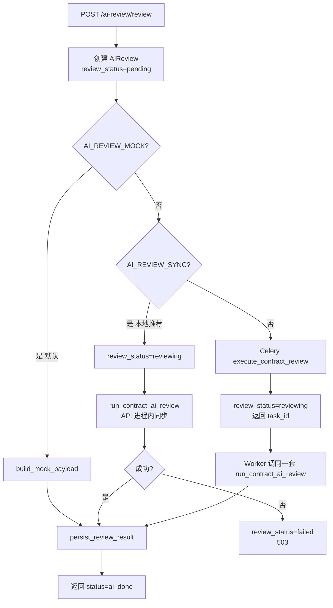

# AI 合同审查流程说明

> **文档定位**：描述**当前代码已实现**的 AI 审查端到端流程（入口 → 编排 → 持久化 → 前端交互 → 法务门禁）。  
> **设计蓝图**（Skill 架构、S0–S7 完整 Session、Chroma RAG 等）见 [ai-review-design.md](../design/ai-review-design.md)。  
> **与审批/评审关系**见 [workflow-vs-review.md](../design/workflow-vs-review.md)。

---

## 1. 在合同生命周期中的位置

AI 审查属于**评审轨**的辅助能力，与**审批轨**（部门主管 → 高管等）并行，不占用审批流节点。

```text
起草 / 上传正文
    │
    ├─► AI 审查（本模块）──────► AI 报告 + Issue 列表 + 五门禁
    │         │
    │         └─► 法务确认 / 逐条确认误报
    │
    ├─► 审批轨（Approvals）──► 部门/金额门禁
    │
    └─► 评审轨（Review）────► 法务/财务/高管评审（须过 AI 门禁）
              │
              └─► 退回修订 → 新版本 → 须重新 AI 审查
```

**硬约束（评审提交前）**：`review_service._ensure_ai_gate` 校验：

1. 存在最新 AI 审查，且 `review_status ∈ { ai_done, reviewed, confirmed }`
2. 若 `AI_REQUIRE_CONFIRM=true`，须已法务确认（`reviewed` 或 `confirmed`）
3. 审查绑定的 `version_id` 须等于合同**当前版本**（修订后必须重审）

---

## 2. 触发入口

| 入口 | 触发时机 | 代码位置 |
|------|----------|----------|
| **手动 API** | 用户或前端调用 `POST /api/v1/ai-review/review` | `backend/app/api/v1/ai_review.py` |
| **新建合同** | 提交审批成功后，前端后台 `void` 调用，不阻塞 UI | `frontend/src/views/contract/CreateContractView.vue` |
| **上传附件** | `AI_AUTO_REVIEW_ON_UPLOAD=true` 且解析出正文时同步触发 | `backend/app/api/v1/contracts.py`（upload 分支） |
| **修订提交** | 修订成功后自动 re-review，并跳转 AI 报告页 | `frontend/src/views/contract/RevisionWorkspaceView.vue` |

所有入口最终汇聚到 **`ai_review_service.start_review()`**。

---

## 3. 执行路径（Mock / 同步 MLX / Celery）

由环境变量决定，逻辑在 `start_review()`：



| 配置组合 | 典型场景 | 返回状态 | 耗时 |
|----------|----------|----------|------|
| `AI_REVIEW_MOCK=1`（**默认**） | 演示 / CI / 无 MLX | 立即 `ai_done` | ~0s |
| `AI_REVIEW_MOCK=0` + `AI_REVIEW_SYNC=1` | 本机 MLX（见 `backend/docs/mlx-local-dev.md`） | 同步 `ai_done` 或 503 | 数十秒～数分钟 |
| `AI_REVIEW_MOCK=0` + `AI_REVIEW_SYNC=0` | 生产异步 | `reviewing` → Worker 写 `ai_done` | 异步 |

**MLX 连接**：OpenAI 兼容 HTTP → `AI_BASE_URL`（默认 `http://127.0.0.1:27366/v1`），模型 `AI_MODEL`。

---

## 4. 编排流水线（Orchestrator）

真实审查（非 Mock）由 `AiReviewOrchestrator.run()` 执行，对应设计文档 S2–S6 子集：

```text
合同正文 + contract_type + amount
        │
        ▼
┌───────────────────┐
│ S2 通读 read_through │  LLM 摘要：主体/标的/价款/交付/违约/争议
└─────────┬─────────┘
          ▼
┌───────────────────┐
│ S3 规则 rule_engine  │  预付款比例、checklist、大额阈值等硬规则
└─────────┬─────────┘
          ▼
┌───────────────────┐
│ S6 条款 LLM 审查     │  切条款 → 五维并行 review_contract()
└─────────┬─────────┘
          ▼
┌───────────────────┐
│ merge_issues         │  规则 + LLM 去重，保留高风险
└─────────┬─────────┘
          ▼
┌───────────────────┐
│ S5 RAG enrich_issues │  关键词匹配 legal_snippets.json 补 legal_basis
└─────────┬─────────┘
          ▼
┌───────────────────┐
│ Self-Correction      │  LLM 二次质检 + apply_high_risk_guardrail
└─────────┬─────────┘
          ▼
┌───────────────────┐
│ build_gates          │  计算五门禁 pass/warn/fail/pending
└─────────┬─────────┘
          ▼
   persist_review_result
```

### 4.1 五维 LLM 审查

`ai_engine.review_contract()` 对切分后的条款并行调用 MLX，维度与 Skill 映射见 `issue_schema.DIMENSION_ALIASES`：

| 维度 ID | 含义 | 典型检查 |
|---------|------|----------|
| `compliance_check` | 合规审查 | 强制性规定、主体资格 |
| `risk_assessment` | 风险条款 | 违约、管辖、解除 |
| `finance_check` | 财务条款 | 付款、预付款、税务 |
| `performance_check` | 履约能力 | 交付、验收、质保 |
| `anomaly_detection` | 异常检测 | 矛盾、缺失、偏离模板 |

### 4.2 统一 Issue Schema

Mock、规则引擎、LLM、RAG 产出均归一为 `AiReviewIssue`（Pydantic），再写入表 `ai_review_issues`：

| 字段组 | 代表字段 | 说明 |
|--------|----------|------|
| 定位 | `clause`, `clause_id`, `clause_ref` | 条款引用 |
| 分类 | `dimension`, `label_id`, `gate_id`, `cuad_code` | 维度 / 15 类 risk_label / 门禁 |
| 风险 | `risk_level`, `confidence`, `title`, `description`, `suggestion` | 等级 low～critical |
| 依据 | `legal_basis`, `source`, `rule_id` | 来源 rule / llm / rag / mock |
| 人工 | `human_status`, `human_comment` | pending → confirmed / false_positive |
| 修订 | `revision_method` | `comment` 或 `track_changes` |

写入策略：`replace_review_issues` **按 review_id 先删后插**。

### 4.3 五门禁（Gate）

`skills/gates.build_gates()` 汇总为 UI 上的 `AiGateSummary`：

| Gate ID | 判定逻辑（摘要） |
|---------|------------------|
| `gate_validity` | 规则源 + 效力类 high/critical → **fail**；维度分 &lt;50 → warn |
| `gate_subject` | 通读摘要主体含「待」→ warn |
| `gate_clause` | 有 high/critical issue → **fail**；有 medium+ → warn |
| `gate_consistency` | 存在 consistency 类 issue → warn |
| `gate_output` | 固定 **pending**（待法务确认终稿） |

Mock 模式使用 `ai_review_demo.DEMO_GATES`；`latest-review` 在无 gates 时可回退 DEMO 数据。

---

## 5. 数据模型与状态机

### 5.1 `AIReview`（表 `ai_reviews`）

ORM 定义在 `backend/app/models/contract.py`。

| 字段 | 说明 |
|------|------|
| `review_id` | 唯一 ID，格式 `REV-{timestamp}-{uuid8}` |
| `contract_id`, `version_id` | 关联合同与版本 |
| `overall_risk_level/score`, `recommendation` | 综合结论 |
| `clause_reviews`, `rule_violations`, `summary` | JSON 字符串（含 gates、dimensions、read_through） |
| `review_status` | 见下方状态机 |
| `celery_task_id`, `reviewer_id` | 异步任务 ID / 确认人 |

```text
review_status 状态机：

  pending ──(Celery)──► reviewing ──► ai_done ──(confirm)──► reviewed
                │                      │
                └──────────────────────┴──► failed

法务评审门禁允许：ai_done | reviewed | confirmed（定义于 contract_state.AI_READY_STATUSES）
```

### 5.2 `AIReviewIssue`（表 `ai_review_issues`）

ORM：`backend/app/models/ai_review_issue.py`。

---

## 6. HTTP API 一览

前缀：`/api/v1/ai-review`（`backend/main.py` 注册）。

| 方法 | 路径 | 功能 |
|------|------|------|
| `POST` | `/review` | 发起审查 `{ contract_id }` |
| `GET` | `/{review_id}/result` | 轮询结果（pending/reviewing 返回中间态） |
| `GET` | `/{review_id}/report?format=pdf\|html\|json` | 导出报告 |
| `POST` | `/{review_id}/feedback` | 误报/漏报反馈（写入 summary.feedbacks） |
| `GET` | `/{review_id}/issues` | Issue 分页列表 |
| `PATCH` | `/issue/{issue_id}` | 更新 `human_status` / `human_comment` |
| `POST` | `/{review_id}/confirm` | 法务确认报告 → `review_status=reviewed` |
| `GET` | `/contracts/{contract_id}/latest-review` | 合同最新审查（无记录时 200 + null，非 404） |

演示/种子：`ai_review_demo.py`、`ai_review_seeds.py`（同 prefix）。

---

## 7. Issue 人工处理流程

```text
AI 产出 issue（human_status=pending）
        │
        ├─► 评审工作台 ReviewWorkspaceView
        │     「确认」→ PATCH human_status=confirmed
        │     「误报」→ PATCH human_status=false_positive
        │
        ├─► AI 报告页 AiReviewView
        │     「误报/漏报」→ POST feedback（不改 Issue 行）
        │     「确认 AI 报告」→ POST confirm → review_status=reviewed
        │
        └─► 修订工作台 RevisionWorkspaceView
              revision_method=comment 的 issue → 预填修订说明
              revision_method=track_changes → 黄色提示条
```

---

## 8. 前端用户旅程

```text
┌─────────────────────────────────────────────────────────────┐
│ 新建合同 CreateContractView                                   │
│   创建 → 提交审批 → 后台触发 AI 初筛（可选 toast）              │
└───────────────────────────┬─────────────────────────────────┘
                            ▼
┌─────────────────────────────────────────────────────────────┐
│ AI 审查报告 AiReviewView          route: /ai-review/:id?      │
│   latest-review 加载报告 + AiGateSummary 五门禁               │
│   「触发审查」→ 轮询 latest（2s）直至非 reviewing/pending      │
│   按维度/风险/标签筛选；导出 PDF；确认 AI 报告                 │
│   「提交法务评审」→ review-workspace                          │
└───────────────────────────┬─────────────────────────────────┘
                            ▼
┌─────────────────────────────────────────────────────────────┐
│ 评审工作台 ReviewWorkspaceView    route: /review-workspace/:id│
│   workspace API：AI 摘要 + top_clauses + ai_issues            │
│   逐条确认/误报；确认 AI 报告                                  │
│   法务/财务/高管 Tab 提交评审（_ensure_ai_gate）               │
│   「退回修订」→ revision-workspace                            │
└───────────────────────────┬─────────────────────────────────┘
                            ▼
┌─────────────────────────────────────────────────────────────┐
│ 修订工作台 RevisionWorkspaceView  route: /contracts/:id/revision│
│   非 draft 须先「模拟法务退回」                                │
│   提交修订 → 自动 re-review → 跳转 ai-review                  │
└─────────────────────────────────────────────────────────────┘
```

**前端 API 封装**：`frontend/src/api/ai-review.ts`。

---

## 9. 环境变量

| 变量 | 默认值 | 含义 |
|------|--------|------|
| `AI_REVIEW_MOCK` | `True` | 演示 Mock，跳过 MLX |
| `AI_REVIEW_SYNC` | `True` | Mock=0 时在 API 进程同步调 MLX |
| `AI_MODEL` | `mlx-community/Qwen3.6-35B-A3B-4bit` | MLX 模型名 |
| `AI_BASE_URL` | `http://127.0.0.1:27366/v1` | MLX OpenAI 兼容端点 |
| `AI_API_KEY` | `local` | |
| `AI_TEMPERATURE` | `0.1` | |
| `AI_MAX_TOKENS` | `4096` | |
| `AI_AUTO_REVIEW_ON_UPLOAD` | `False` | 上传后自动审查 |
| `AI_REVIEW_SELF_CORRECT` | `True` | LLM 二次质检 |
| `AI_REQUIRE_CONFIRM` | `False` | 评审前须法务确认 AI 报告 |
| `AI_PARSE_MOCK` | `True` | 合同文件解析 Mock（独立模块） |

本地真实 MLX 示例：`.env.mlx.example`（`AI_REVIEW_MOCK=0`）。

---

## 10. 关键代码路径

```text
backend/
├── app/api/v1/ai_review.py              # REST API
├── app/api/v1/ai_review_demo.py         # DEMO_ISSUES / DEMO_GATES
├── app/api/v1/contracts.py              # 上传触发 auto review
├── app/core/config.py                   # AI 环境变量
├── app/models/contract.py               # AIReview ORM
├── app/models/ai_review_issue.py        # AIReviewIssue ORM
├── app/services/ai_review_service.py    # start_review / persist / confirm
├── app/services/ai_review_issue_service.py
├── app/services/ai_review_report_service.py
├── app/services/review_service.py       # _ensure_ai_gate / workspace
├── app/services/contract_state.py       # AI_READY_STATUSES
├── app/celery_tasks/ai_review_tasks.py  # 异步 Worker
└── app/services/ai_review/
    ├── orchestrator.py                  # S2→S3→S6→merge→S5→反思→gates
    ├── runner.py                        # API/Celery 共用入口
    ├── ai_engine.py                     # 五维并行 MLX
    ├── rule_engine.py
    ├── rag_service.py
    ├── issue_schema.py
    ├── clause_parser.py
    └── skills/
        ├── read_through.py
        ├── gates.py
        └── self_correction.py

frontend/
├── src/api/ai-review.ts
├── src/views/ai/AiReviewView.vue
├── src/views/review/ReviewWorkspaceView.vue
├── src/views/contract/CreateContractView.vue
├── src/views/contract/RevisionWorkspaceView.vue
└── src/components/AiGateSummary.vue
```

---

## 11. 与设计文档的差距（V1 现状）

| 设计目标（ai-review-design.md） | 当前实现 |
|--------------------------------|----------|
| S0 client_context / S1 review_state / S7 clause_extract | 未实现 |
| Chroma 向量 RAG | 关键词匹配 `legal_snippets.json` |
| 53 项效力门禁逐项 | 规则引擎 Batch-1 + gates_v2 + checklist_coverage |
| Chroma 向量 RAG | BM25（`AI_RAG_MODE=bm25`）已实现；Chroma 待 Phase AI-4 |
| Session 时间线 API | 无 |
| Policy YAML 热更新 | 部分 JSON 种子 + thresholds.json |
| docx 三件套导出 | PDF / HTML / JSON 报告 |

**补强方案**（2026-05-25 已落地）：[ai-review-capability-hardening-design.md](../plans/ai-review-capability-hardening-design.md) — prompt_builder、llm_gateway、completeness、revision_router、text_segmenter、metrics、Celery 验收脚本等。

完整能力按 [DESIGN_STATUS.md](../design/DESIGN_STATUS.md) 分期落地；本文档随代码演进更新。

---

## 12. 扫描 PDF / OCR

无文字层的扫描 PDF 在 `AI_OCR_ENABLED=1` 时由 [`text_extractor.py`](../../backend/app/services/ai_review/text_extractor.py) 调用 EasyOCR 回退；`POST /api/v1/contracts/parse` 与上传落库均会写回 `contract.content`。

| 配置 | 默认 | 说明 |
|------|------|------|
| `AI_OCR_ENABLED` | true | 关闭则仅 PyMuPDF |
| `AI_OCR_MIN_CHARS` | 200 | 低于此字数触发 OCR |
| `AI_OCR_MAX_PAGES` | 40 | 页数上限 |

验收脚本：`backend/scripts/test_lanzhou_tobacco_pdf_review.py`（详见 [mlx-local-dev.md](../../backend/docs/mlx-local-dev.md) §5.1）。

---

## 13. 相关文档

| 文档 | 说明 |
|------|------|
| [ai-review-capability-hardening-design.md](../plans/ai-review-capability-hardening-design.md) | **AI 审查能力补强**（Phase AI-2.5/AI-3 详细设计与验收） |
| [ai-review-design.md](../design/ai-review-design.md) | Skill 架构与 S0–S7 设计蓝图 |
| [contract-review-pro-seeds.md](./contract-review-pro-seeds.md) | 上游种子数据落库 |
| [review-process-design.md](./review-process-design.md) | 法务/财务/高管评审流程 |
| [backend/docs/mlx-local-dev.md](../../backend/docs/mlx-local-dev.md) | 本机 MLX 启动与 OCR 验收 |
| [backend/docs/celery-setup.md](../../backend/docs/celery-setup.md) | Celery 异步审查 |
